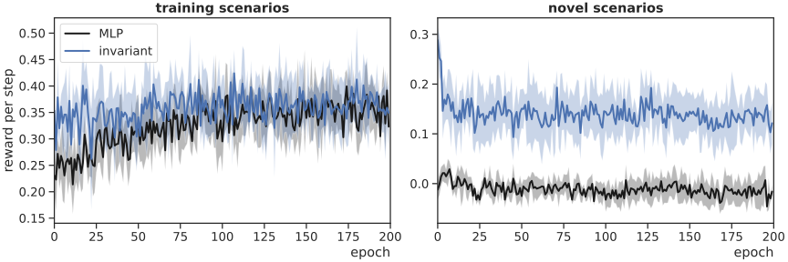

# NASimEmu-agents
This is a repository containing deep RL agents for [NASimEmu](https://github.com/jaromiru/NASimEmu).

## Usage
Install [NASimEmu](https://github.com/jaromiru/NASimEmu) and run training as:
```
python main.py <path-to-scenario>
```

Alternatively, you can test a trained model as an example below:
```
# make sure to edit the code to use the NASimNetInvMAct model
python main.py -load_model trained_models/wrk02-sm2md-inv-peq-mact.pt --trace ../NASimEmu/scenarios/sm_entry_dmz_three_subnets.v2.yaml
```

## Choosing a model to train / test
Currently, the MLP and invariant models are available. (Un)comment corresponding lines in `nasim_problem/nasim_config.py`. For example:
```
config.net_class = NASimNetMLP
# config.net_class = NASimNetInvMAct
```

## Experiments excerpt
Below, you can see the results of the **md2sm** experiment. The MLP and invariant models were tested in their training scenarios and in novel, structurally different scenarios. More information in the [research article](https://arxiv.org/abs/2305.17246). 

<div align=center>
    
</div>


