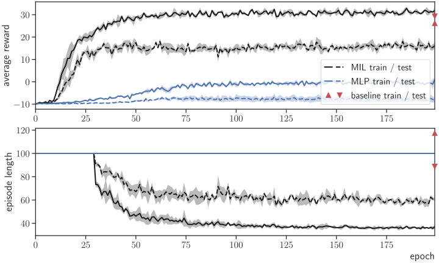
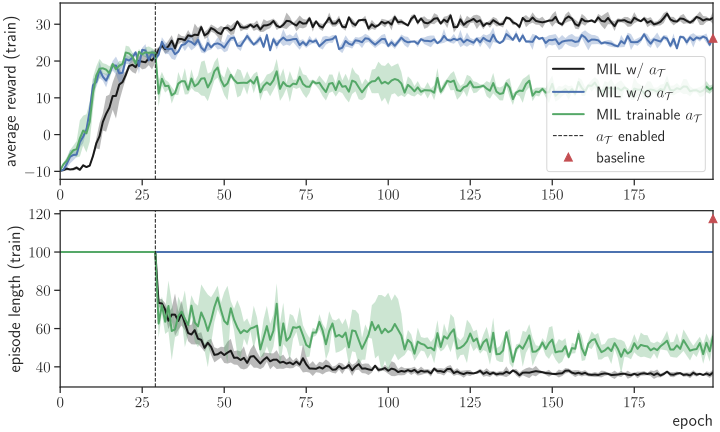
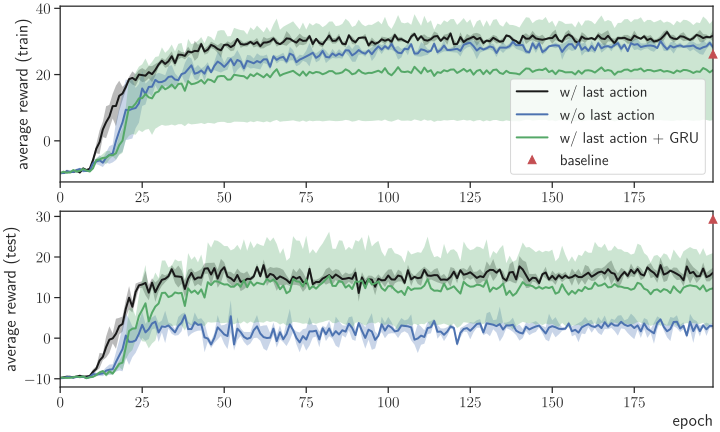
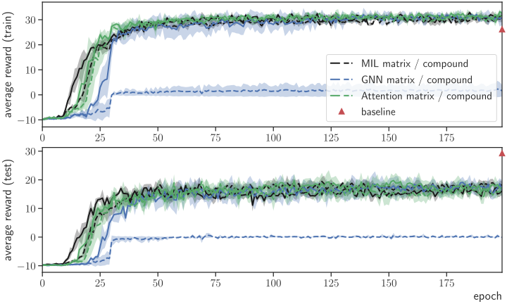
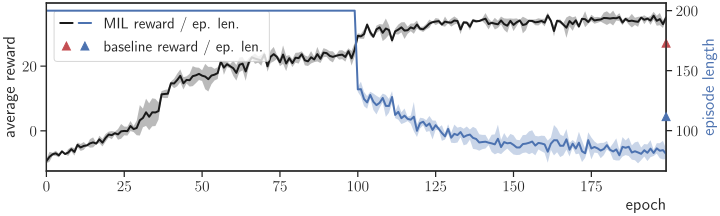

# NASimEmu-agents
This is a repository containing deep RL agents for [NASimEmu](https://github.com/jaromiru/NASimEmu).

Related [workshop paper](https://arxiv.org/abs/2305.17246), and [dissertation (chapter 6)](https://dspace.cvut.cz/handle/10467/114377).

## Usage
Install [NASimEmu](https://github.com/jaromiru/NASimEmu) and run training as:
```
python main.py <path-to-scenario>
```

Alternatively, you can test a trained model as an example below:
```
mkdir out/
python main.py -load_model trained_models/mlp.pt --trace ../NASimEmu-public/scenarios/uni.v2.yaml -device cpu -net_class NASimNetMLP -use_a_t -episode_step_limit 100 -augment_with_action
```


## Experiments excerpt
Generalization of invariant architectures vs. MLP:
<div align=center>
    
</div>

Training to stop:
<div align=center>
    
</div>

Last action embedding:
<div align=center>
    
</div>

Comparison of architecture variants:
<div align=center>
    
</div>

Scaling experiment:
```
main.py huge-gen-rgoal-stoch -device cpu -cpus 2 -epoch 100 -max_epochs 200 --no_debug -net_class NASimNetInvMAct -force_continue_epochs 100 -use_a_t -episode_step_limit 200 -augment_with_action
```
<div align=center>
    
</div>

## Transfer to emulation
Simulation-trained agents can be transferred to emulation, see the emulation [log](docs/emulation.txt).
